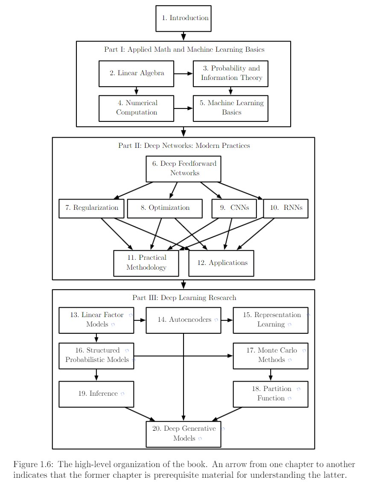

# Resource

- 课程网站：https://web.eecs.umich.edu/~justincj/teaching/eecs498/WI2022/
- 课程视频：https://www.youtube.com/playlist?list=PL5-TkQAfAZFbzxjBHtzdVCWE0Zbhomg7r
- 课程教材：仅有推荐教材，链接：https://www.deeplearningbook.org/
- 课程作业：见课程主页，6 个 Assignment 和一个 Mini-Project

## 教材组织形式

# Note

> 这个目录存放学习的一些笔记，摘录
