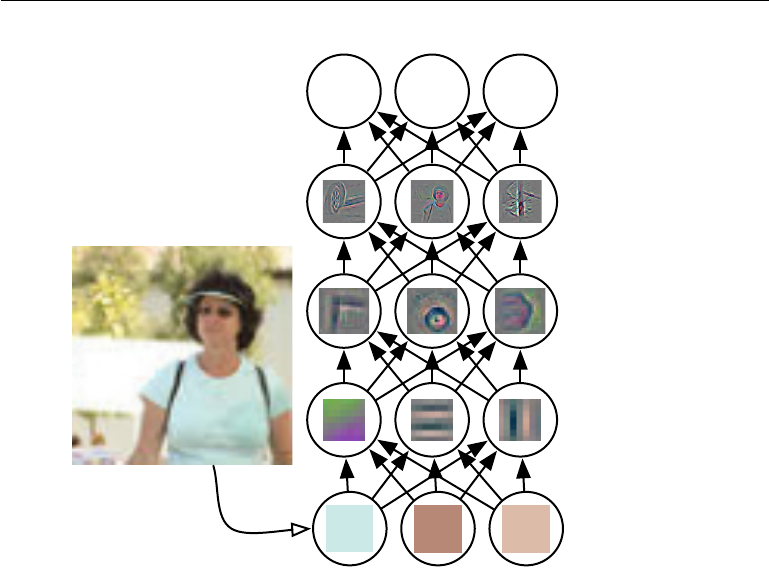
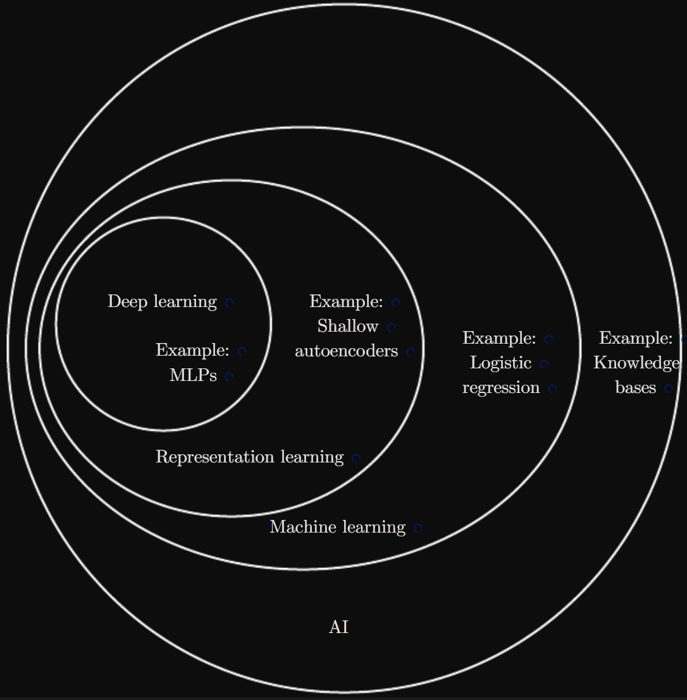
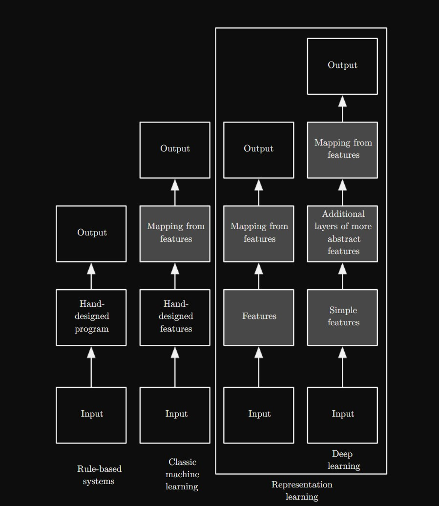

# Introduction

## representation && feature

简单的机器学习算法的性能很大程度上取决于它们获得的数据表示方式。

以逻辑回归算法(logistic regression)为例

> 当用于预测剖宫产手术时,该算法并不直接检查患者,而是由医生提供一些相关信息,如是否有子宫疤痕等。
> 这些信息被称为特征,逻辑回归算法学习这些特征与不同结果之间的相关性。但算法本身无法影响这些特征的定义方式。
> 如果算法获得的是患者的MRI扫描图像,而不是医生的正式报告,它就无法做出有用的预测。
> 因为MRI图像中的单个像素与分娩过程中可能出现的并发症之间几乎没有相关性。

**总的来说,机器学习算法的性能很大程度上取决于数据的表示方式,如果数据表示不合适,算法即使再复杂也无法做出有效的预测。因此,如何选择和定义特征是机器学习中很关键的一步。**

## representation learning

为了解决抽取数据 feature的问题，引入了 representation learning这个概念

**Use machine learning to discover not only the mapping from representation to output but also the representation itself.
This approach is known as representation learning.**

> 一个经典的 representation learning 的例子是 **autoencoder**

深度学习使计算机能够从更简单的概念中构建复杂的概念。

> 图 1.2 显示了深度学习系统如何通过结合更简单的概念（例如角和轮廓）来表示人的图像概念。

## relationship of subjects

> Figure 1.4: A Venn diagram showing how deep learning is a kind of representation learning,which is in turn a kind of machine learning, which is used for many but not all approachesto AI. Each section of the Venn diagram includes an example of an AI technology.

> Figure 1.5: Flowcharts showing how the different parts of an AI system relate to eachother within different AI disciplines. Shaded boxes indicate components that are able tolearn from data.
